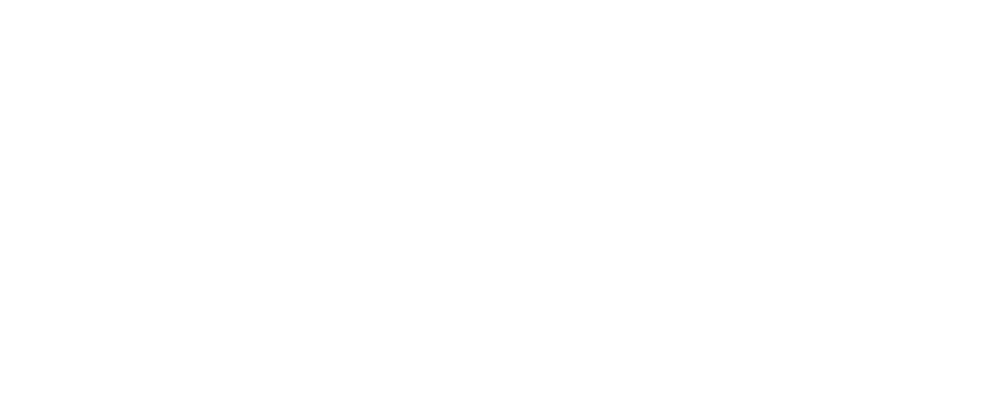

**OpenCMF** is an open-source, modular surgical planning system specifically designed for the **Craniomaxillofacial (CMF)** field. 

Developed **by surgeons, for surgeons**, this platform is built on the foundation of free, collaborative software culture, aiming to provide high-level tools for clinical analysis and surgical simulation.

---

## 🛠️ Requirements & Technologies

* **Language:** Python 3.11+
* **GUI Framework:** PySide6 (Qt for Python)
* **3D Engine:** VTK (Visualization Toolkit)
* **Data Processing:** NumPy

---

---
*Developed with a focus on innovation and precision in Oral and Maxillofacial Surgery.*